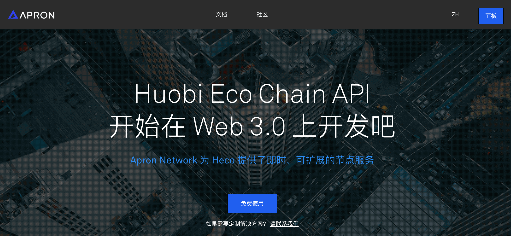
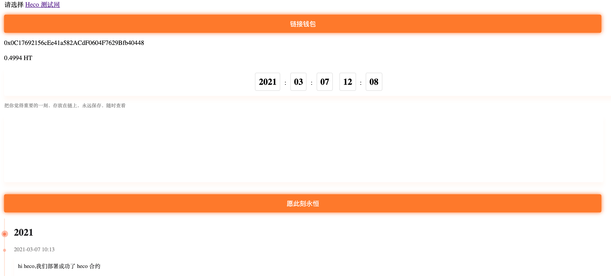
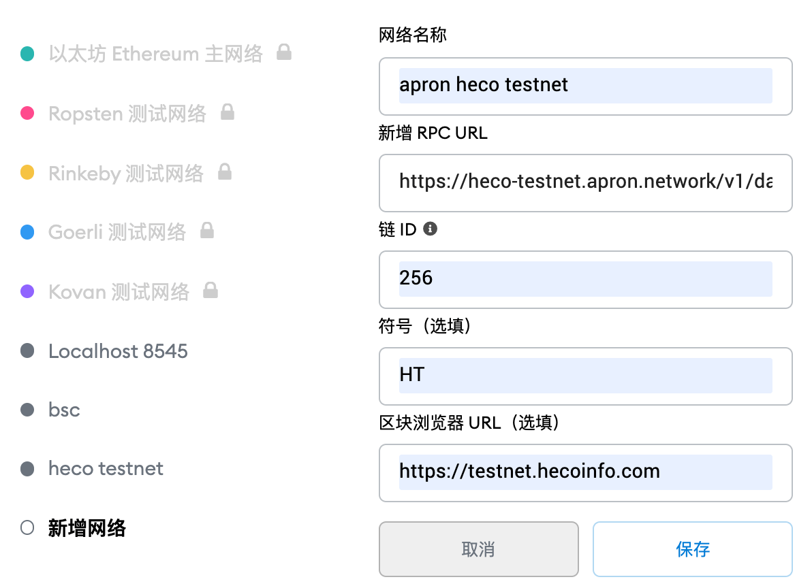
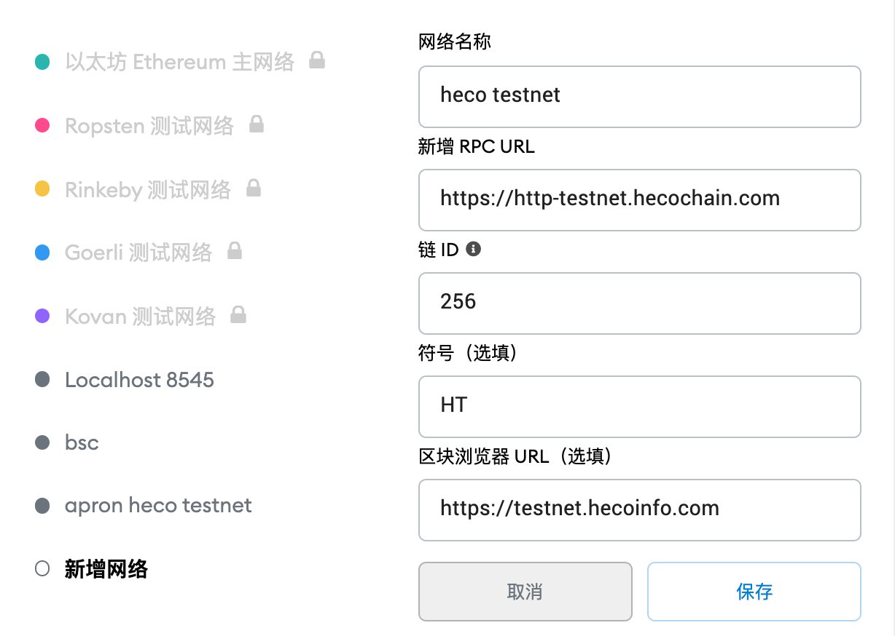
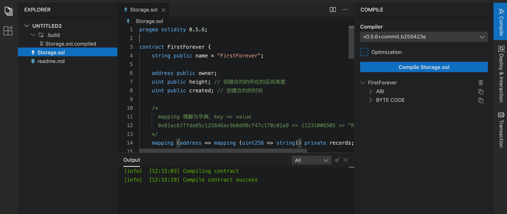
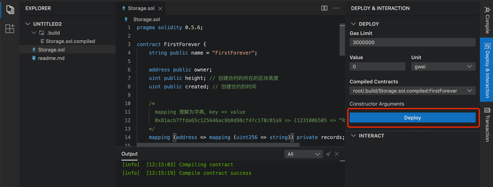

# 如何在 heco 上部署智能合约

https://apron.network/ 提供 heco rpc支持

> 

## Heco

火币生态链 Huobi ECO Chain (Heco) 是一个去中心化的高效节能公链，火币生态链 Heco 的原生数字资产为 HT，采用 HPoS 共识机制。 Heco 在支撑高性能交易的基础上，也兼容 Eth 的智能合约，即 Solidity 也可以部署在 Heco 上。

## 项目

FirstForever，是个类似微博的项目，通过页面，我们可以记录当前时刻发生的故事，然后点击按钮，记录到链上。

> 

## chainIDE

IDE，我推荐 https://eth.chainide.com/ ，remix 很不错的，但在国内 chinaIDE 的访问速度更快。
而且 remix 的功能，chainIDE 基本都是支持的。

## Metamask

访问 https://metamask.io/download.html ，获取插件钱包

## 添加 heco testnet rpc 网络

### 添加 Apron heco testnet rpc

chainid：256

rpc：`https://heco-testnet.apron.network/v1/<apikey>`

区块浏览器：`https://testnet.hecoinfo.com`

> 

### 添加官方 testnet rpc

chainid：256

rpc：`https://http-testnet.hecochain.com`

区块浏览器：`https://testnet.hecoinfo.com`

> 

## heco 测试币

访问 https://scan-testnet.hecochain.com/faucet ，验证github账户，然后就可获得heco测试币。

## 合约

```js
pragma solidity 0.5.6;

contract FirstForever {
    string public name = "FirstForever";

    address public owner;
    uint public height; // 创建合约的所在的区块高度
    uint public created; // 创建合约的时间

    /*
      mapping 理解为字典，key => value
      0x81acb7ffda65c125646ac9b8d98cf47c170c01a9 => {1231006505 => "Rebase Team"}
    */
    mapping (address => mapping (uint256 => string)) private records;

   /*
      0x81acb7ffda65c125646ac9b8d98cf47c170c01a9 => 235833
    */
    mapping (address => uint256[]) private categories;

    event Recorded(address _sender, string indexed _text, uint256 indexed _time); // 定义事件

    constructor() public { // 构造函数
        height = block.number; // 合约创建时对应的区块高度
        created = block.timestamp; // 合约创建时间
        owner = msg.sender; // 发送者
    }

    function _addToList(address from, uint256 time) private { // 私有方法
        categories[from].push(time); // mapping 添加一个元素
    }

    function getList()
    public // public是公共方法
    view // view表示这是个查询方法,不改变数据状态
    returns (uint256[] memory)// 返回的数据类型
    {
        return categories[msg.sender];
    }

    function add(string memory text, uint256 time) public { // 公共方法, 外部可以调用
        records[msg.sender][time] = text; // 赋值
        _addToList(msg.sender, time); // 调用方法
        emit Recorded(msg.sender, text, time); // 触发事件
    }

    function get(uint256 time) public view returns(string memory) { // 公共方法, 外部可以调用
        return records[msg.sender][time];
    }

    function getContractAddr() public view returns(address){ // 获得合约地址
        return address(this);
    }
}
```

## 编译

> 

## 部署

> 

## 总结

在 heco 上部署合约，跟在 eth 上部署合约，是基本类似的。

只要注意 2 点就可以，

- MetaMask 的 network 换为 heco testnet，或者 heco mainnet。

- 去 heco 水龙头获取测试币

注：heco mainnet 网络

chainid：128

rpc：`https://http-mainnet-node.huobichain.com/`

区块浏览器：`https://hecoinfo.com`

---

参考链接：

https://dashboard.apron.network/

https://eth.chainide.com/

https://scan-testnet.hecochain.com/faucet

https://docs.hecochain.com/#/testnet

https://docs.hecochain.com/#/mainnet

https://docs.hecochain.com/#/dev/contract
